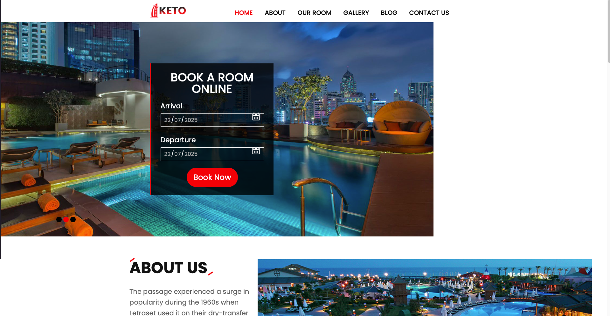
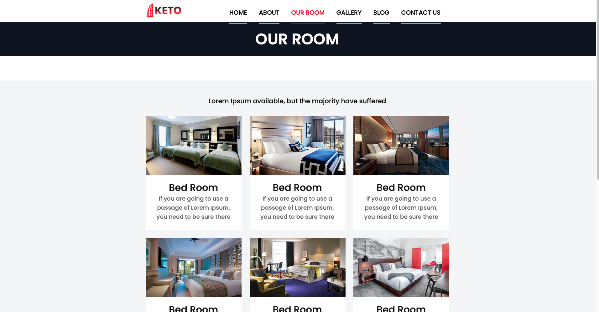
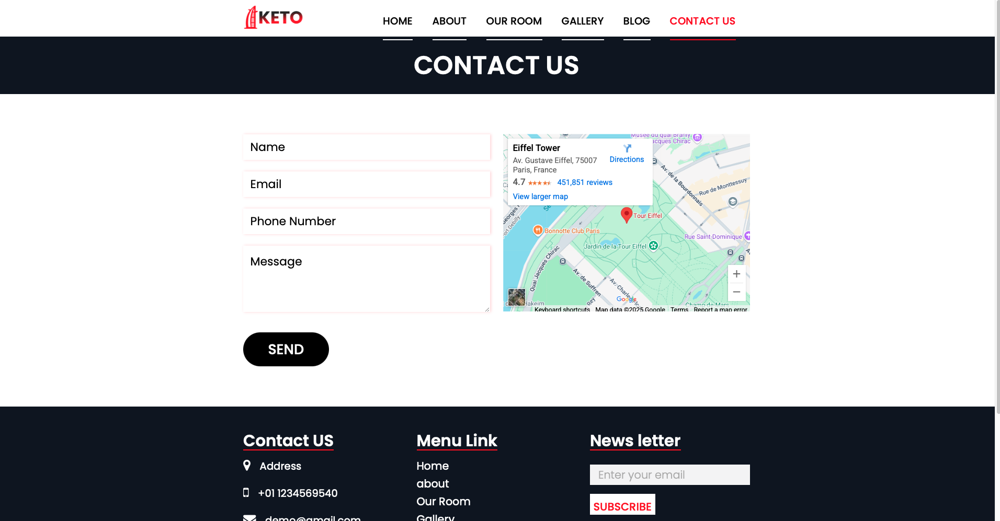

# 🏨 KETO Hotel Booking Frontend

This is the **frontend** of the KETO Hotel Booking App — a clean, responsive hotel website built with HTML, CSS, and JavaScript. It includes multiple pages such as Home, Rooms, Contact, and Gallery.

---

## 🚀 Live Demo

🔗 [Visit the Live Site](https://your-vercel-link.vercel.app)

---

## 📸 Screenshots

### 🖼 Home Page

### 🖼 Room Page

### 🖼 Contact Page

> 📁 Save your screenshots in a `screenshots/` folder inside the project root.

---

## 🧩 Pages Included

- `index.html` – Homepage  
- `about.html` – About the Hotel  
- `room.html` – Room Listing  
- `gallery.html` – Photo Gallery  
- `contact.html` – Contact Form  
- `blog.html` – Blog Page

---

## 🛠 Technologies Used

- HTML5
- CSS3
- JavaScript
- Bootstrap 4
- Font Awesome
- jQuery Plugins (Fancybox, Owl Carousel, etc.)

---

## 📁 Folder Structure

